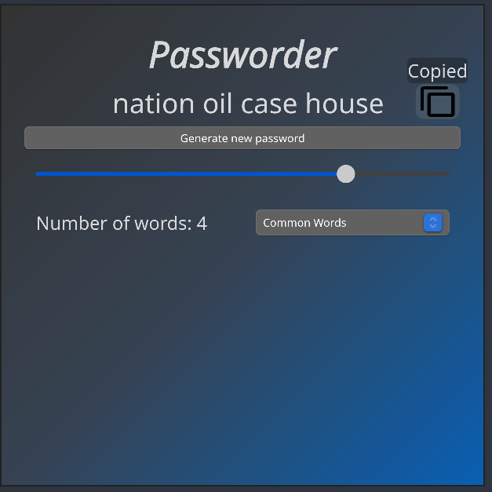

# Slint C++ Project

A  C++ application that's using [Slint](https://slint.dev) for generating easy-to-remember passwords.

## About

 My first project with Slint. I wanted to make an app, which would allow me to generate usefull passwords i can later use. Best passwords are ones you can easily remember but do not contain anything related to you such as favorite dates or names. Instead, use a combination of random words, numbers, and special characters to create a strong and secure password. 

## First look on the app (VERY Early stage)



 ## Prerequisites

In order to use this template and build a C++ application, you need to install a few tools:

  * **[cmake](https://cmake.org/download/)** (3.21 or newer)
  * A C++ compiler that supports C++ 20 
  * Copy functionality works only with `xclip` for now

If your target environment is Linux or Windows on an x86-64 architecture, then you may also opt into downloading one of our binary Slint packages. These are pre-compiled and require no further tools. You can find setup instructions and download links at

<https://slint.dev/docs/cpp/cmake.html#install-binary-packages>

Alternatively, this template will automatically download the Slint sources and compile them. This option requires you to install Rust by following the [Rust Getting Started Guide](https://www.rust-lang.org/learn/get-started). Once this is done, you should have the ```rustc``` compiler and the ```cargo``` build system installed in your path.

## Usage

1. Download and extract the ZIP archive of this repository.

3. Configure with CMake
   ```
   mkdir build
   cmake -B build
   ```
4. Build with CMake
   ```
   cmake --build build
   ```
5. Run the application binary
    * Linux/macOS:
        ```
        ./build/my_application
        ```
    * Windows:
        ```
        build\my_application.exe
        ```
